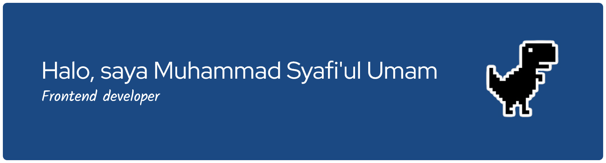

<!-- Banner -->

🎓 Mahasiswa **Teknik Informatika** di **Universitas YARSI**  
📚 Saat ini sedang menempuh **semester 7**, dan memiliki minat besar di bidang **pengembangan perangkat lunak**, **teknologi web**, dan **desain antarmuka**.

---

## 🧠 Tentang Saya
- 🔭 Sedang fokus mempelajari **React.js**, **Node.js**, dan berbagai framework modern  
- 💬 Tertarik dengan **pengembangan front-end**, **UI/UX**, serta **arsitektur sistem**  
- 🌱 Terus mengasah kemampuan dalam **Java**, **JavaScript**, dan **pengembangan backend**  
- 🎯 Tujuan saya adalah menjadi seorang **Front-End / Full-Stack Developer** yang mampu menciptakan solusi digital yang bermanfaat dan efisien  

---

## 🛠️ Teknologi yang Dikuasai

### 💻 Bahasa Pemrograman

### ⚙️ Framework

### 🎨 Tools & Library

### 🗄️ Basis Data

---

## 📊 Statistik GitHub (Total)
  

---

## ✨ Fakta Menarik
- ☕ Kopi adalah bahan bakar utama saya saat ngoding  
- 🧩 Suka menyelesaikan tantangan coding dan membuat program lebih efisien  
- 🎵 Musik jadi teman terbaik saat menulis kode  

---

## 📫 Hubungi Saya

---

> *"Koding itu seperti seni — butuh logika, rasa, dan ketekunan untuk membuat sesuatu yang indah."*

---

<!-- GIF favorit -->

  

