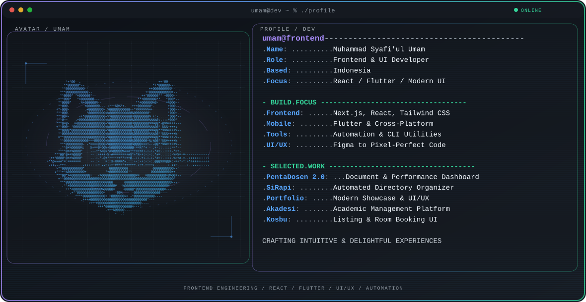

  <picture>
    <source media="(max-width: 760px) and (prefers-color-scheme: dark)" srcset="./assets/hero/builder-profile-v2-mobile-dark.svg">
    <source media="(max-width: 760px)" srcset="./assets/hero/builder-profile-v2-mobile-light.svg">
    <source media="(prefers-color-scheme: dark)" srcset="./assets/hero/builder-profile-v2-dark.svg">
    <source media="(prefers-color-scheme: light)" srcset="./assets/hero/builder-profile-v2-light.svg">
    
  </picture>

  <a href="https://www.syafiul.id/"><strong>View Portfolio</strong></a> ·
  <a href="https://www.linkedin.com/in/muhammad-syafi-ul-umam-689b0b1ba/"><strong>LinkedIn</strong></a> ·
  <a href="mailto:muhammadumamsyafiul@gmail.com"><strong>Email</strong></a>

## Recent Activity

<!-- AUTO:ACTIVITY:START -->
- Sep 11, 2026: pushed 1 commit to [Umam07/Kodera](https://github.com/Umam07/Kodera).
- Sep 10, 2026: created a branch in [Umam07/Kodera](https://github.com/Umam07/Kodera).
- Sep 10, 2026: pushed 1 commit to [Umam07/flow-btc](https://github.com/Umam07/flow-btc).
- Sep 7, 2026: pushed 1 commit to [Umam07/flow-btc](https://github.com/Umam07/flow-btc).
- Sep 7, 2026: pushed 1 commit to [Umam07/Portofolio-Baru](https://github.com/Umam07/Portofolio-Baru).
- Sep 6, 2026: pushed 1 commit to [Umam07/Portofolio-Baru](https://github.com/Umam07/Portofolio-Baru).
<!-- AUTO:ACTIVITY:END -->
