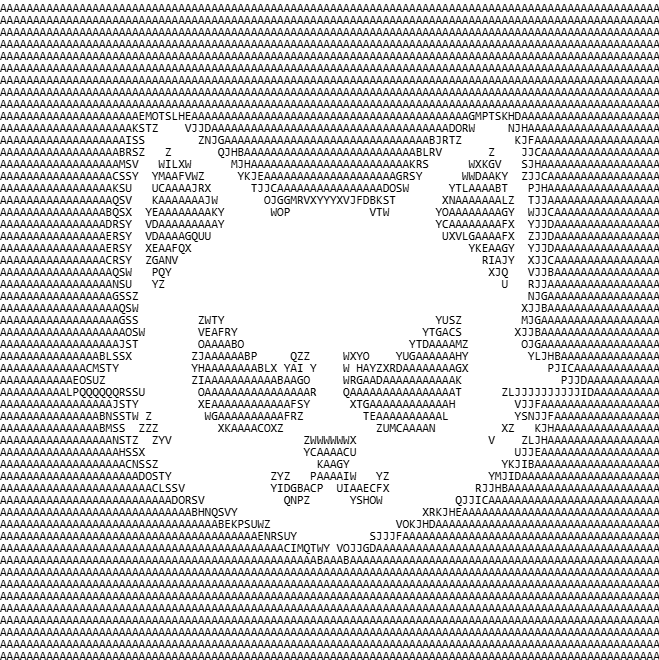

  

<h1 align="center">Umam</h1>

Frontend Developer • Informatics Engineering Student

  Aku bikin antarmuka yang bersih, ringkas, dan enak dipakai.

  <a href="https://itsumam.vercel.app/">Portfolio</a> ·
  <a href="https://www.linkedin.com/in/muhammad-syafi-ul-umam-689b0b1ba/">LinkedIn</a> ·
  <a href="mailto:muhammadumamsyafiul@gmail.com">Email</a>

  

  Saat ini fokus ke React, Flutter, dan UI/UX.

