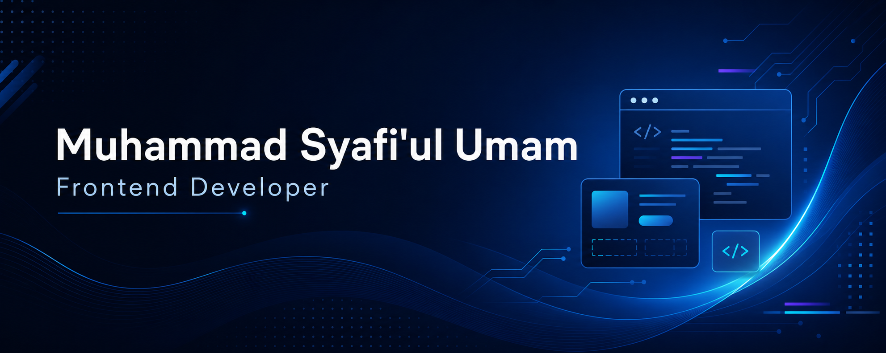

  

<h1 align="center">Hi, I'm Umam</h1>

<h3 align="center">Frontend Developer | Informatics Engineering Student</h3>

  I turn ideas into clean, responsive, and useful digital experiences. 
  Currently studying Informatics Engineering at Universitas YARSI.

  
  
  

 

<h2 align="center">About Me</h2>

| | |
|---|---|
| **Focus** | Frontend Development & UI/UX |
| **Currently learning** | React, Flutter & modern web practices |
| **Goal** | Building intuitive products as a Frontend / Full-Stack Developer |
| **Based in** | Indonesia |

 

<h2 align="center">Tech Stack</h2>

  

 

<h2 align="center">GitHub Stats</h2>

  

  
  

 

  <i>Code, learn, improve, repeat.</i>

  

